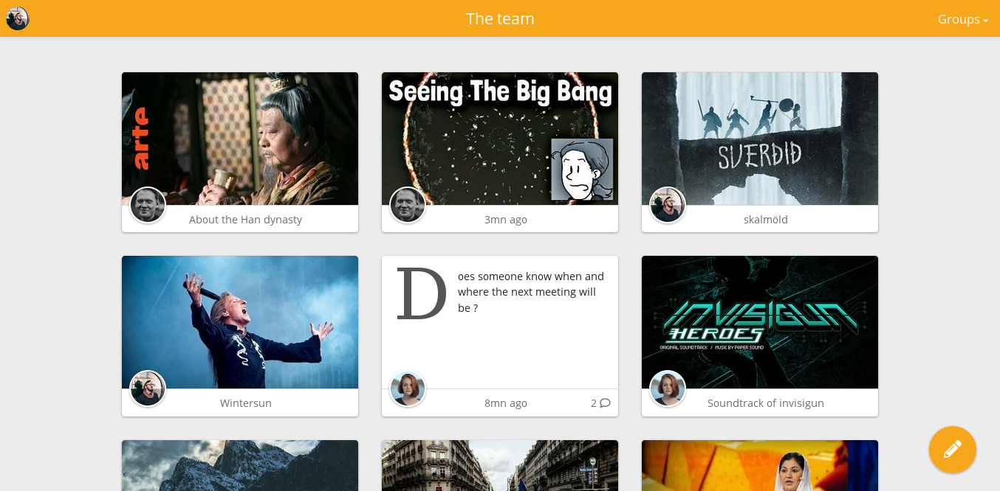

<!--
Nota bene : ce README est automatiquement généré par <https://github.com/YunoHost/apps/tree/master/tools/readme_generator>
Il NE doit PAS être modifié à la main.
-->

# Zusam pour YunoHost

[](https://ci-apps.yunohost.org/ci/apps/zusam/)


[](https://install-app.yunohost.org/?app=zusam)

*[Lire le README dans d'autres langues.](./ALL_README.md)*

> *Ce package vous permet d’installer Zusam rapidement et simplement sur un serveur YunoHost.*  
> *Si vous n’avez pas YunoHost, consultez [ce guide](https://yunohost.org/install) pour savoir comment l’installer et en profiter.*

## Vue d’ensemble

Zusam (/tsuˈzam/) est un moyen libre et gratuit d'auto-héberger des forums privés pour des groupes d'amis. Composé d'un serveur écrit en PHP exposant une API REST et d'une application web légère, Zusam est extensible et facile à installer.
L'objectif est de disposer d'un outil stable, extensible, léger et convivial pour auto-héberger des groupes sociaux privés.

### Features

- Prévisualisation des liens et contenu intégré (Youtube, Vimeo, Imgur, Soundcloud, Twitch, Bandcamp...)
- Téléversement de vidéos et d'images
- Albums photos
- Génération de liens publics pour les messages
- Design entièrement réactif (*responsive*) et adapté aux mobiles
- Faible empreinte serveur


**Version incluse :** 0.5.6~ynh2

**Démo :** <https://demo.zusam.org>

## Captures d’écran



## Documentations et ressources

- Site officiel de l’app : <https://zusam.org>
- Documentation officielle de l’admin : <https://github.com/zusam/zusam/tree/master/documentation>
- Dépôt de code officiel de l’app : <https://github.com/zusam/zusam>
- YunoHost Store : <https://apps.yunohost.org/app/zusam>
- Signaler un bug : <https://github.com/YunoHost-Apps/zusam_ynh/issues>

## Informations pour les développeurs

Merci de faire vos pull request sur la [branche `testing`](https://github.com/YunoHost-Apps/zusam_ynh/tree/testing).

Pour essayer la branche `testing`, procédez comme suit :

```bash
sudo yunohost app install https://github.com/YunoHost-Apps/zusam_ynh/tree/testing --debug
ou
sudo yunohost app upgrade zusam -u https://github.com/YunoHost-Apps/zusam_ynh/tree/testing --debug
```

**Plus d’infos sur le packaging d’applications :** <https://yunohost.org/packaging_apps>
